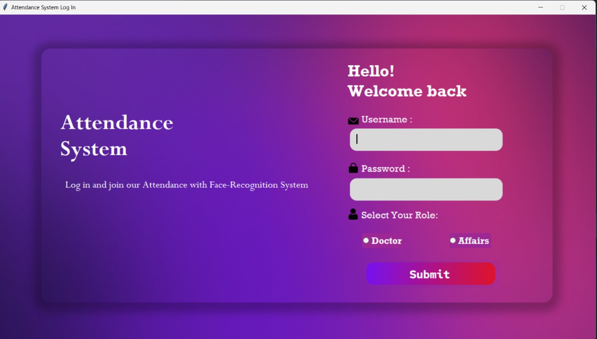
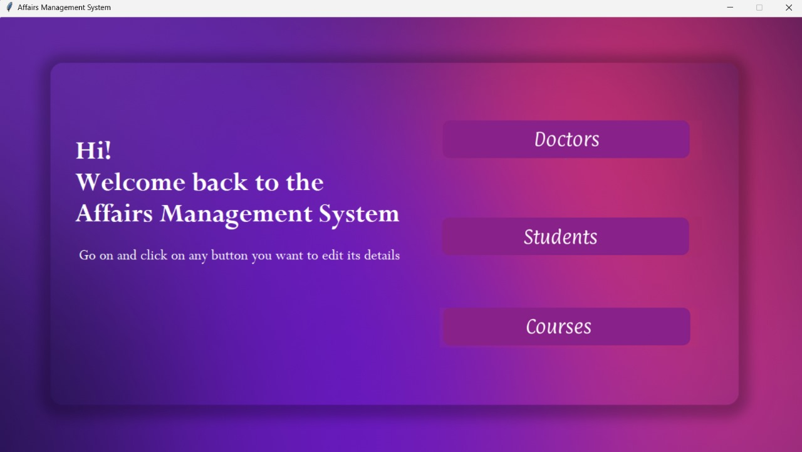
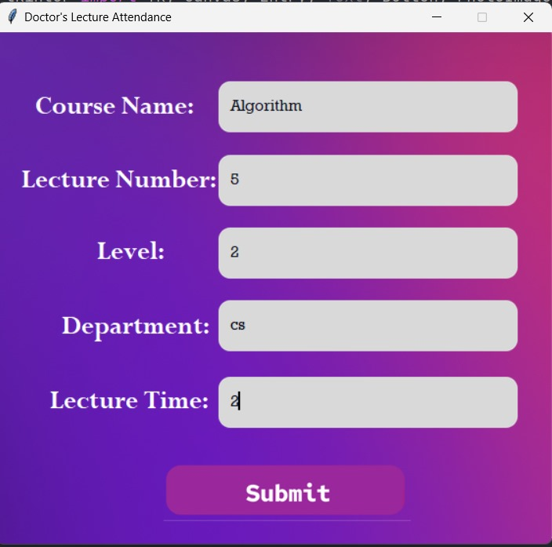
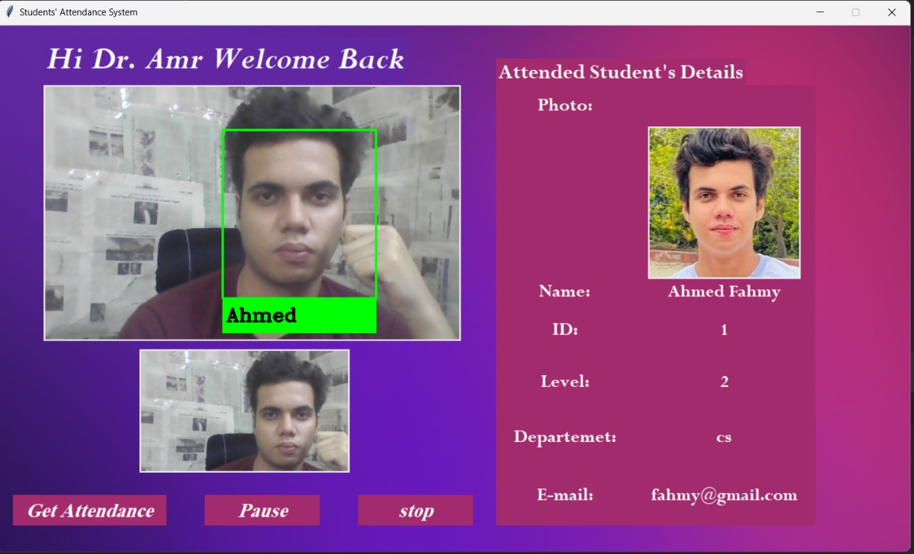

# College Management System

## 📖 About the Project
This is a **desktop application** designed for college management, developed as a project for the **Information Systems (IS)** course in my second year of college. The system provides comprehensive tools to streamline administrative tasks and automate attendance using facial recognition.

## 💡 Objective
The main goal of this project was to demonstrate the application of **Information Systems concepts** in a real-world scenario, showcasing:
- Efficient data handling using Firebase.
- Automated attendance using AI-based facial recognition.
- User-friendly interfaces for diverse roles (e.g., professors and administrative staff).

## 🚀 Features
### 1. **Student Affairs Module**
   - Add, edit, or delete student, professor, or course records.
   - Manage and update academic data easily.

### 2. **Professor Module**
   - Log lecture details including:
     - Lecture name.
     - Duration.
     - Target class (year/section).
   - Take attendance using **facial recognition** technology.

### 3. **Face Recognition Attendance**
   - Utilizes the `face_recognition` library for accurate detection.
   - Secure and efficient way to mark student attendance.

### 4. **Database Integration**
   - Powered by **Firebase** for real-time data storage and synchronization.
   - Ensures reliability and scalability.

---

## 🛠️ Technologies Used
- **Programming Language**: Python
- **GUI**: Tkinter
- **Database**: Firebase
- **Libraries**:
  - `face_recognition`: For attendance via facial recognition.
  - `firebase_admin`: For Firebase database integration.

---

## 📸 Screenshots
Below are screenshots showcasing the application's functionality:

### Login Screen


### Affairs Module


### Professor Module


### Attendance with Face Recognition

---

## 📂 Project Structure
```plaintext
College-Management-System/
│
├── EncodeFile.p           # Encoded data for facial recognition
├── serviceAccountKey.json # Firebase configuration file
├── screenshots/           # Folder containing screenshots
├── doctor/                # Code related to professor module
├── images/                # Static images used in the application
├── login/                 # Login module files
├── affairs/               # Files for student affairs module
└── README.md              # Project documentation

